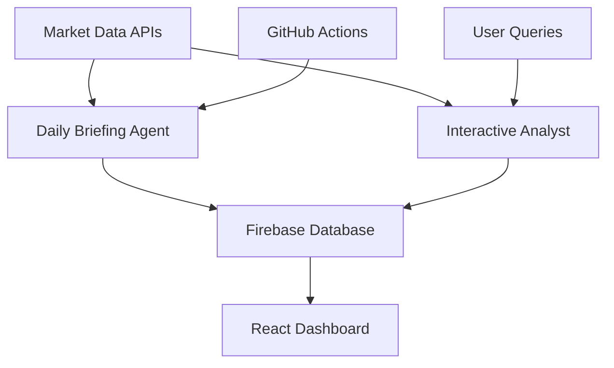

# 🚀 DeFi Daily Briefing Agent

> An intelligent, multi-agent system that provides automated daily crypto market analysis and interactive investment guidance.


## 🎯 Project Vision

This project builds a sophisticated AI agent system that:
- **Generates daily crypto market briefings** with intelligent analysis
- **Provides interactive investment guidance** through conversational AI
- **Monitors portfolio performance** and identifies opportunities
- **Automates research tasks** that typically take 30+ minutes daily

## 🏗️ System Architecture



## 📊 Core Features

### Phase 1: Daily Briefing System
- **Automated Data Collection**: Fear & Greed Index, BTC Dominance, TVL changes
- **Portfolio Tracking**: BTC, ETH, SOL, SUI, XRP, HBAR, TAO, AERO
- **Narrative Analysis**: Top trending DeFi narratives with TVL growth data
- **Risk Monitoring**: Liquidations, stablecoin flows, whale activity
- **Event Calendar**: Upcoming macro events, token unlocks, protocol launches

### Phase 2: Interactive Analyst
- **Natural Language Queries**: "Should I enter a SOL/USDC LP position?"
- **Strategy Analysis**: Risk assessment for any DeFi strategy
- **Smart Contract Auditing**: Automated security checks
- **Yield Optimization**: Compare opportunities across protocols
- **Portfolio Recommendations**: Personalized based on risk profile

## 🛠️ Tech Stack

| Component | Technology | Purpose |
|-----------|------------|---------|
| **Agent Framework** | LangGraph | Multi-agent orchestration |
| **Backend** | Python 3.13+ | Data processing & AI logic |
| **Frontend** | React 18 | Interactive dashboard |
| **Database** | Firebase Firestore | Data persistence & real-time sync |
| **Deployment** | Vercel | Hosting & auto-deployment |
| **AI Models** | Claude Sonnet 4 | Analysis & reasoning |
| **Scheduling** | GitHub Actions | Automated daily briefings |

## 🚦 Getting Started

### Prerequisites
- Python 3.13+
- Node.js 18+
- Git CLI
- Claude Pro subscription
- Firebase account (free tier)
- GitHub account

### Quick Start
```bash
# Clone the repository
git clone https://github.com/YOUR_USERNAME/defi-briefing-agent.git
cd defi-briefing-agent

# Install Python dependencies
pip install -r requirements.txt

# Install Node.js dependencies
cd frontend && npm install && cd ..

# Set up environment variables
cp .env.example .env
# Edit .env with your API keys

# Run the development server
python backend/main.py
```

## 📈 Development Progress

### Current Status: Week 1, Day 1 ✅
- [x] Project structure established
- [x] Documentation system created
- [x] Development workflow defined
- [ ] Git CLI setup (Day 2)
- [ ] React project creation (Day 3)
- [ ] First API integration (Day 4)

### Upcoming Milestones
- **Week 2**: Multi-agent data collection system
- **Week 3**: Claude-powered analysis and synthesis  
- **Week 4**: Professional dashboard + live deployment
- **Week 5**: Interactive conversational advisor
- **Week 6**: Advanced features and production polish

## 📋 API Data Sources

| Source | Purpose | Rate Limits |
|--------|---------|-------------|
| CoinGecko | Token prices, market data | 45 calls/min (free) |
| DeFiLlama | TVL data, protocol info | Unlimited |
| Alternative.me | Fear & Greed Index | Unlimited |
| CryptoPanic | News aggregation | Free tier available |
| CoinGlass | Liquidation data | Some free endpoints |

## 🎯 User Profile & Use Case

**Target User**: Crypto investor seeking consistent monthly DeFi returns
- **Capital**: $1,000-$1,500 starting capital
- **Risk Tolerance**: 20-30% acceptable drawdowns
- **Leverage Comfort**: Maximum 3x leverage
- **Networks**: Base, Solana, Sui (primary)
- **Experience**: Familiar with VFAT, Uniswap, Orca; wants to explore Kamino, Pendle

## 📖 Documentation

- [Setup Guide](docs/SETUP.md) - Initial installation and configuration
- [API Configuration](docs/API_KEYS.md) - Setting up data source access
- [Development Log](docs/DEVELOPMENT_LOG.md) - Daily progress tracking
- [Deployment Guide](docs/DEPLOYMENT.md) - Going live with Vercel

## 🤝 Contributing

This is currently a personal learning project, but contributions and suggestions are welcome!

1. Fork the repository
2. Create a feature branch (`git checkout -b feature/amazing-feature`)
3. Commit your changes (`git commit -m 'Add amazing feature'`)
4. Push to the branch (`git push origin feature/amazing-feature`)
5. Open a Pull Request

## 📄 License

This project is licensed under the MIT License - see the [LICENSE](LICENSE) file for details.

## 🙏 Acknowledgments

- **LangGraph** for the agent orchestration framework
- **DeFiLlama** for comprehensive DeFi data
- **CoinGecko** for reliable market data
- **Claude** for AI-powered analysis capabilities

---

**Built with ❤️ and Claude Code** | **Learning Goal**: Master multi-agent AI systems